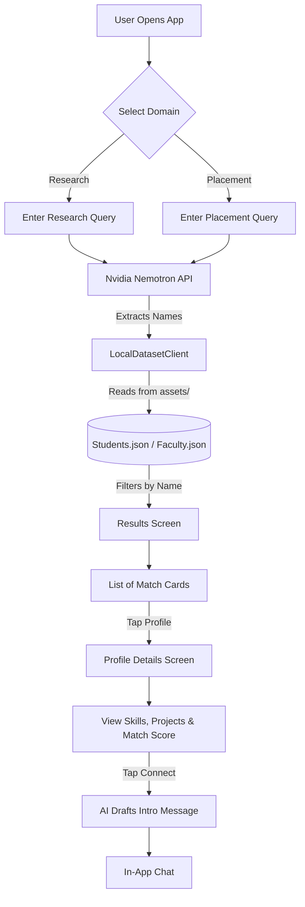

# Campus Connect AI (Clover Dynamics)

A native Android application designed to facilitate campus discovery. Instead of acting like a traditional chatbot, Campus Connect helps students find peers and faculty who have solved similar problems in research or placement contexts. 

By analyzing overlapping attributes (skills, methodologies, company interviews, domains) using Nvidia's Nemotron AI, the app intelligently extracts candidates and cross-references them against an embedded offline dataset to give you rich, beautiful profile cards of exactly the right people on campus.

## 🌟 Key Features
- **Research Collisions:** Search for overlapping research topics, hardware (e.g., Raspberry Pi), and AI domains.
- **Placement Collisions:** Find seniors or peers who have interviewed at your target companies for specific roles.
- **Nvidia Nemotron LLM:** Powered by `nvidia/nemotron-3.5-lightning-30b-a3b` for fast, intelligent reasoning and entity extraction.
- **Offline Dataset Matching:** Lightning-fast profile matching using bundled `Students.json` and `Faculty.json` datasets inside the app.
- **Glassmorphic UI:** A premium, modern dark-themed profile UI built in Jetpack Compose.

---

## 📐 Architecture Flowchart



---

## 🛠️ Requirements

- **IDE:** Android Studio (Jellyfish or newer recommended).
- **Language:** Kotlin
- **Build System:** Gradle (Kotlin DSL)
- **UI Framework:** Jetpack Compose (Material 3)
- **Minimum SDK:** API 24
- **Target/Compile SDK:** API 35
- **Java Toolchain:** Java 17

## 🚀 How to Setup

1. **Clone the repository:**
   ```bash
   git clone https://github.com/D-Harsha-vardhan/CampusConnect--CloverDynamics.git
   cd CampusConnect--CloverDynamics
   ```

2. **Configure the Nvidia API Key:**
   - Open `app/src/main/java/com/example/collisionengine/data/network/NvidiaClient.kt`
   - Paste your Nvidia API key into the `NVIDIA_API_KEY` constant on Line 13.

3. **Open in Android Studio:**
   - Launch Android Studio and select **File -> Open**.
   - Navigate to the cloned directory and select it.

4. **Sync Gradle & Run:**
   - Click the **Sync Project with Gradle Files** icon (the little elephant).
   - Select an Android Emulator or physical device.
   - Click the green **Run 'app'** button (Shift + F10).

