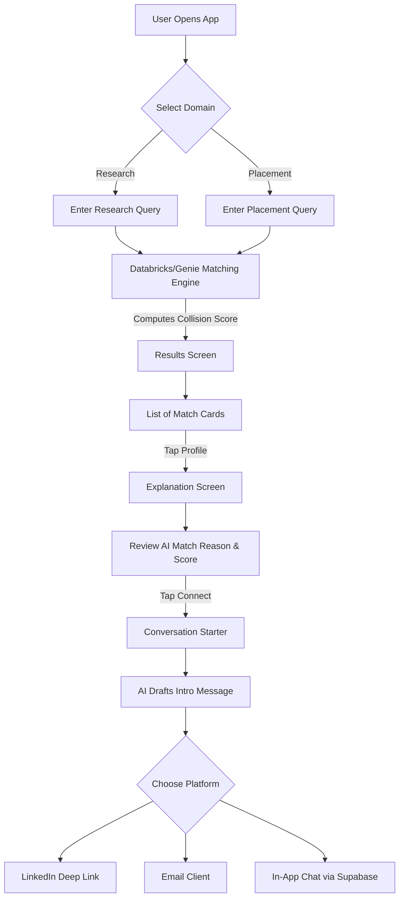

# Campus Connect (formerly The Collision Engine)

A native Android application designed to facilitate campus discovery. Instead of acting like a traditional chatbot, Campus Connect helps students find peers and faculty who have solved similar problems in research or placement contexts. 

By analyzing overlapping attributes (skills, methodologies, company interviews, domains), the app calculates "Collision Scores" to intelligently match you with the exact right people on campus.

## 🌟 Key Features
- **Research Collisions:** Search for overlapping research topics, hardware (e.g., Raspberry Pi), and AI domains.
- **Placement Collisions:** Find seniors or peers who have interviewed at your target companies for specific roles.
- **Explainable AI:** A detailed breakdown of exactly *why* a match was made, providing conversation icebreakers.
- **AI Conversation Starter:** Auto-generated introductory messages based on the shared structural overlap.
- **Feedback Loop:** Built-in 👍/👎 rating system to improve the matching algorithm over time.

---

## 📐 Architecture Flowchart



---

## 🛠️ Requirements

- **IDE:** Android Studio (Jellyfish or newer recommended).
- **Language:** Kotlin
- **Build System:** Gradle (Kotlin DSL)
- **UI Framework:** Jetpack Compose (Material 3)
- **Minimum SDK:** API 24
- **Target/Compile SDK:** API 35
- **Java Toolchain:** Java 17

## 🚀 How to Setup

1. **Clone the repository:**
   ```bash
   git clone https://github.com/D-Harsha-vardhan/CampusConnect--Databricks.git
   cd CampusConnect--Databricks
   ```

2. **Open in Android Studio:**
   - Launch Android Studio and select **File -> Open**.
   - Navigate to the cloned directory and select it.

3. **Configure the JDK:**
   - Go to **File -> Settings -> Build, Execution, Deployment -> Build Tools -> Gradle**.
   - Ensure the **Gradle JDK** is set to **Java 17**. (The project uses the Foojay toolchain resolver to help download this automatically if missing).

4. **Sync Gradle:**
   - Click the **Sync Project with Gradle Files** icon (the little elephant with a sync arrow).

5. **Run the App:**
   - Select an Android Emulator or physical device.
   - Click the green **Run 'app'** button (Shift + F10).

## 🗺️ Next Steps
- **Backend Integration:** Replace the mocked local JSON datasets with a live Databricks REST API.
- **Real-time Chat:** Implement Supabase PostgreSQL WebSockets for the "In-App Chat" functionality.
